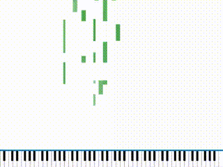

# midi2Tiles

## Demo


## About
This tool create synthesia-like piano tiles effect from midi files.

Although Synthesia provides nice animation, it is not for free.
Hence, I use matplotlib to create the piano tiles animation.

The output video can futher be imported in video editting software such as After Effects as an overlay of your video.

## Install
```
pip install midi2Tiles
```

## Usage
```python
# some video settings
VIDEO_DPI = 1000
VIDEO_FPS = 60
VIDEO_WIDTH = 1080
VIDEO_HEIGHT = 720

# the proportion of keyboard display
KB_RATIO = 0.1

# speed of the falling tiles (pixels per sec)
# notice that this value also affect the height of each tile
TILE_VELOCITY = 500

from midi2Tiles import pianoTileCreator

ptc = pianoTileCreator.PianoTileCreator(video_width=VIDEO_WIDTH,
                                        video_height=VIDEO_HEIGHT,
                                        video_dpi=VIDEO_DPI,
                                        video_fps=VIDEO_FPS,
                                        KB_ratio=KB_RATIO,
                                        tile_velocity=TILE_VELOCITY,
                                        key_color="green",
                                        showKeyVelocity=True)
ptc.loadMidiFile("<input midi file>",verbose=True)
ptc.render("<output video file>",verbose=True)

```

## Parameters

* `video_width (int)`: the width of the output video (px)
* `video_height (int)`: the height of the output video (px)
* `video_dpi (int)`: the dpi of the output video (px)
* `video_fps (int)`: the fps of the output video (px)
* `KB_ratio (float)`: the proportion of the piano keyboard display. This value should be in [0,1)
* `tile_velocity (int)`: the velocity of the falling tiles
* `key_color (string)`: the color of the tiles
* `showKeyVelocity (bool)`: if True, the velocity of midi notes will affect the opacity of the tiles

## Author
Ian Shih
Email: yjshih23@gmail.com

## Acknowledgement
The ratio of the piano design is referenced from https://github.com/gin66/piano_keyboard
